# NHS Notify Web CMS Repository

## About this project

- This site includes the content for the public NHS Notify web site
- It uses Jekyll to generate static web HTML files from markdown content
- the source code for the web site is in /docs folder
- page content is inside the `/docs/pages` folder
- page css is inside `/docs/_sass` folder

## Getting Started - First time setup

This is only needed once.

To get started, please create a new GitHub workspace from the main branch.

This will setup a development environment for you to edit the web site in. The first time this runs, it will take approximately 10 minutes. You do not need to install ANY tools on your local computer.

### Pre-requisites

- A GitHub account
- For submitting changes, code must be signed.
- To sign code using GitHub code spaces, please configure GPG signing for the repository, from your Settings page.

### 1. From a web browser, visit the Web CMS GitHub Repository page

[https://github.com/NHSDigital/nhs-notify-web-cms](https://github.com/NHSDigital/nhs-notify-web-cms)

### 2. Click Code

Click the green `<> Code` button.

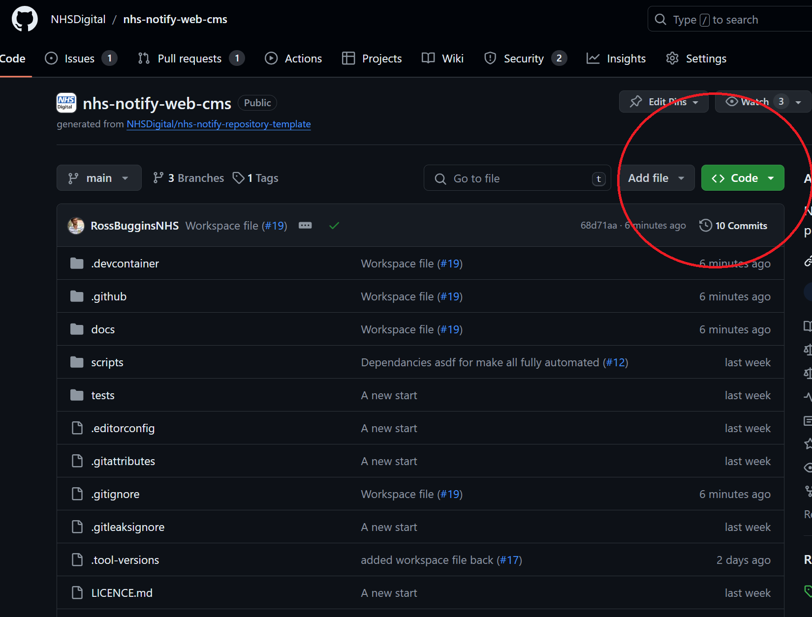

### 3. Create Codespace on main

Click create code space on main

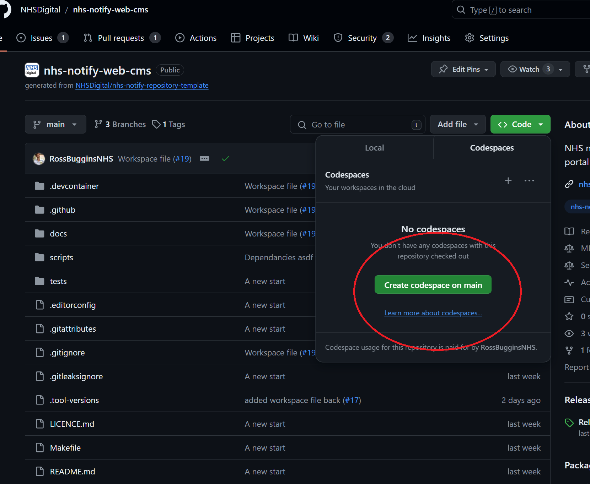

### 4. Wait

- a new browser tab should open
- you will need to wait around 5 - 10 minutes

When it first starts it will look something like this. At it will say opening remote at the bottom left.

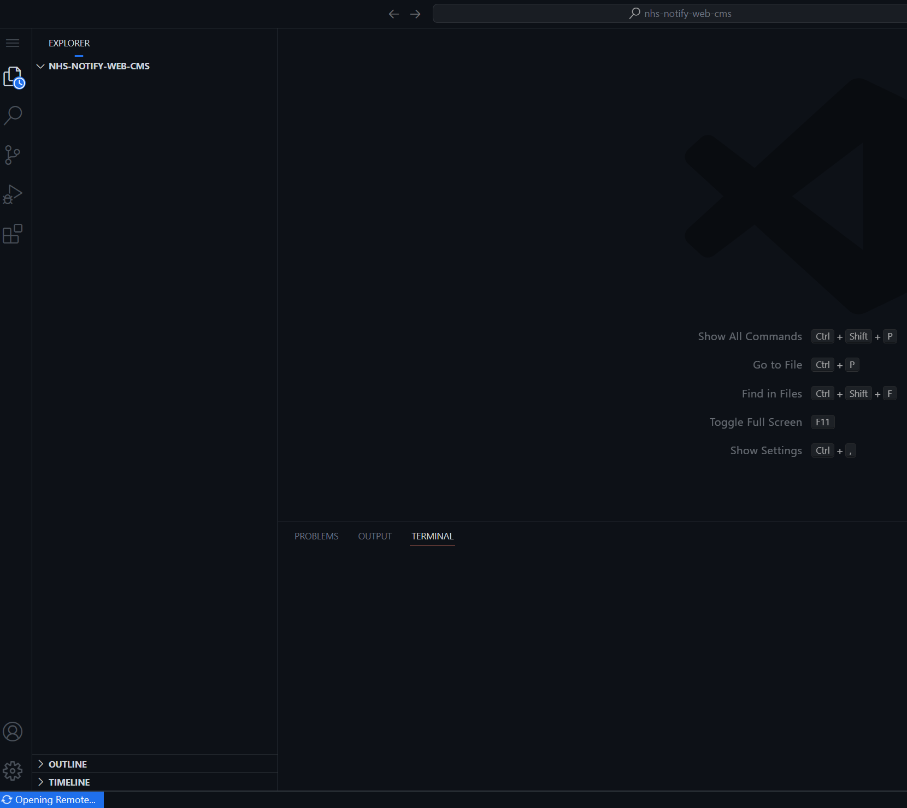

### 5. Launch workspace

You will see a box pop up bottom right notifying you there is a workspace file.

- click the Green button to `Open Workspace`

### 6 . Open parent git repository

Another box will pop up saying a parent git repository has been found. Click the Green `Yes` button to open it.

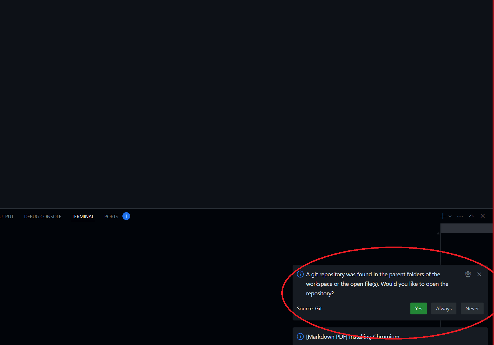

An option should appear at the top of the screen, select the `nhs-notify-web-cms` repository.

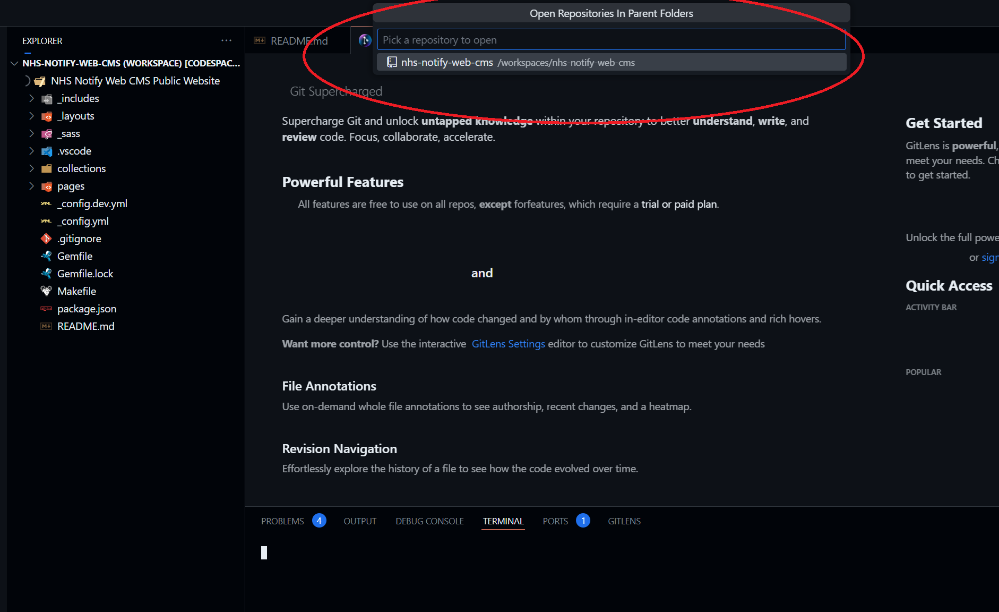

### 5. Test it works

You should be able to run a live version of your changes before you submit them (via a Pull request) for updating the live content.

To do this, click the Run and Debug button, and then click the "Play" icon. Alternatively you can press F5 (warning, if you are not "clicked" in the window, it will refresh your page instead of launching the site).

- click the run and debug button:

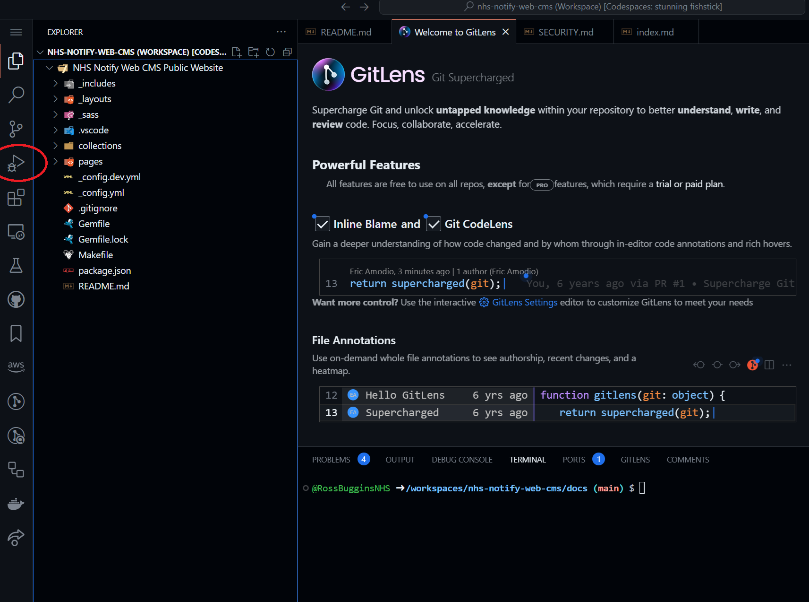

- click the green "Play" button to the left of where it says `Attatch (NHS Notify`

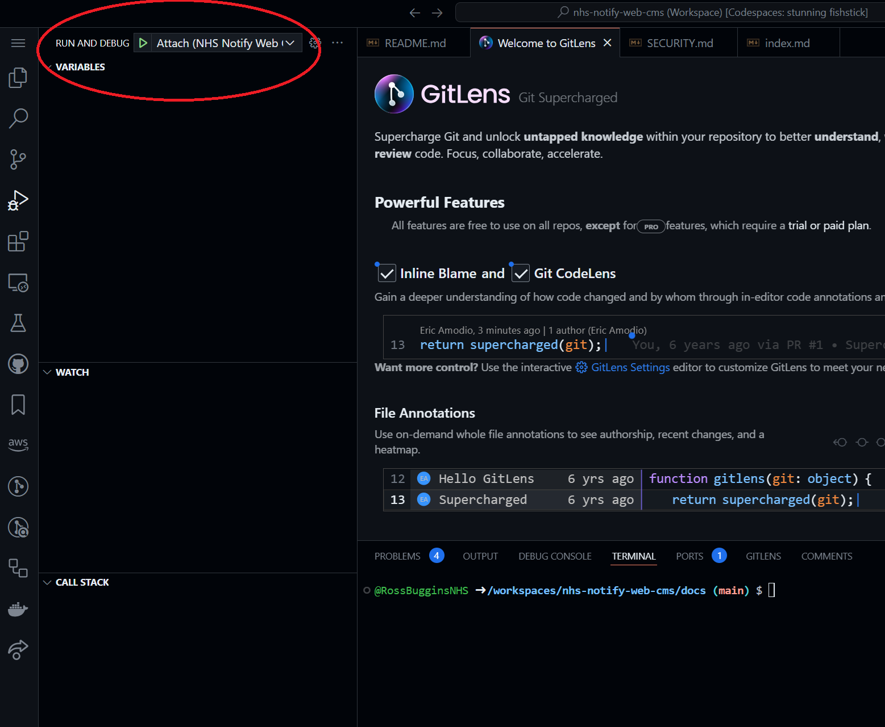

- after a few seconds, you should see moving text at the bottom of the screen and it say `server running`

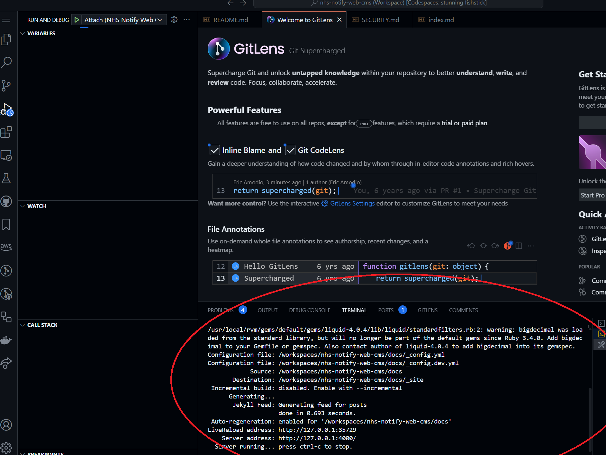

- a box should appear bottom right saying your application is running. Click the green `Open in browser button`

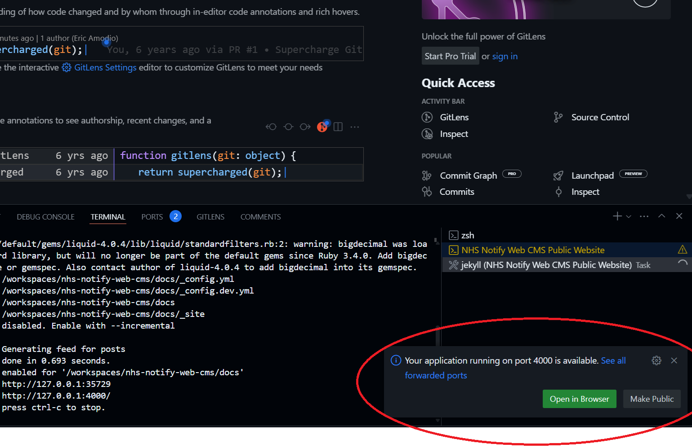

- a new browser tab will open (with a random address), this is live updating as you change the content of the site.

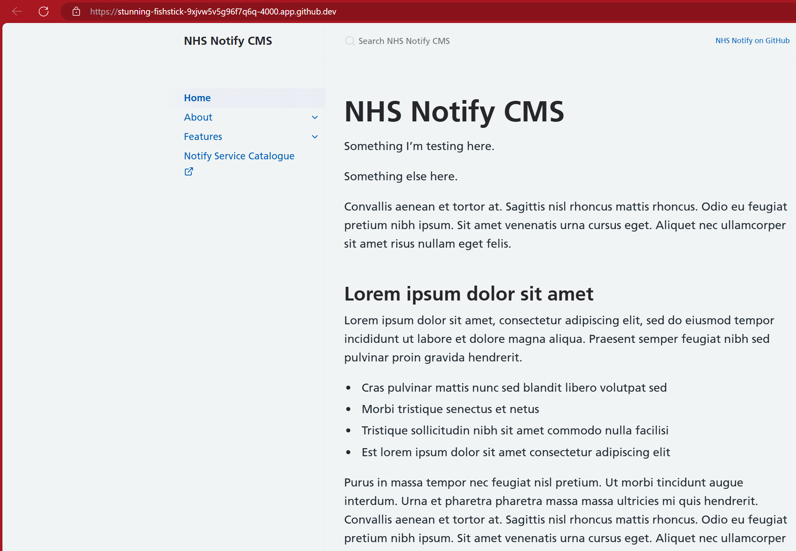

### 6. Make a preview change

- In the previous browser tab, click on the file `Explorer` button to show the file list.

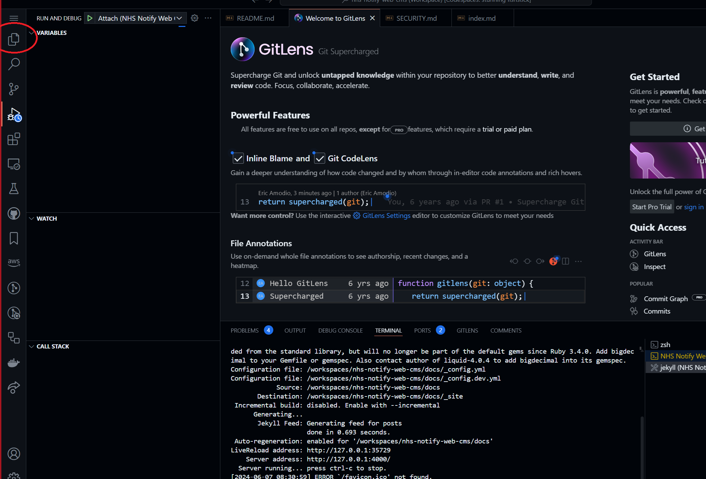

- Click on the `pages` folder, and then `index.md`. This will open the content of the home page.

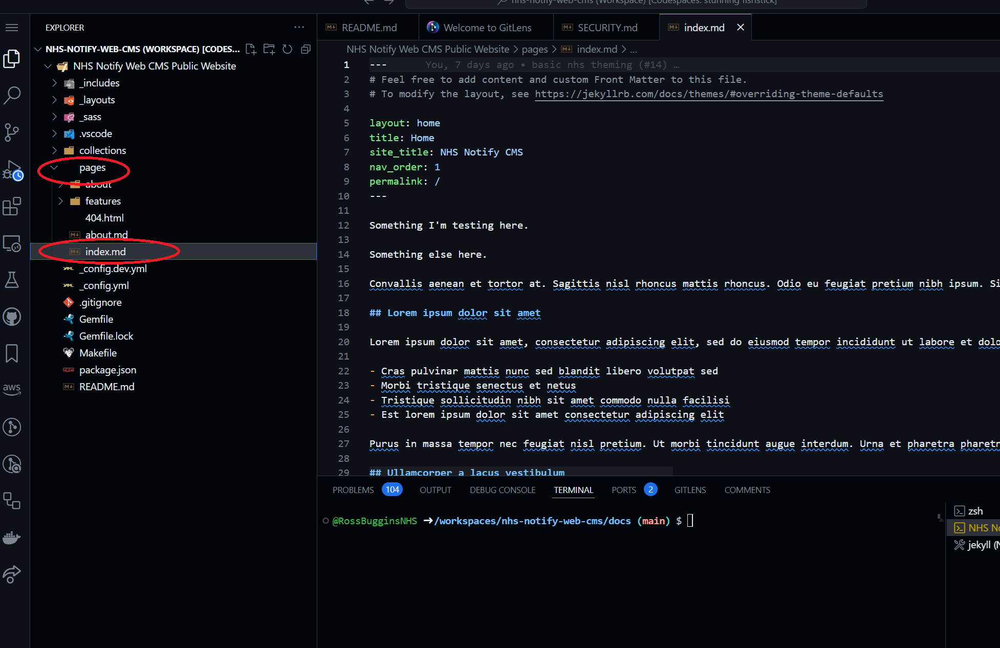

- you can now edit this page. To see a basic preview side by side, click the markdown preview button

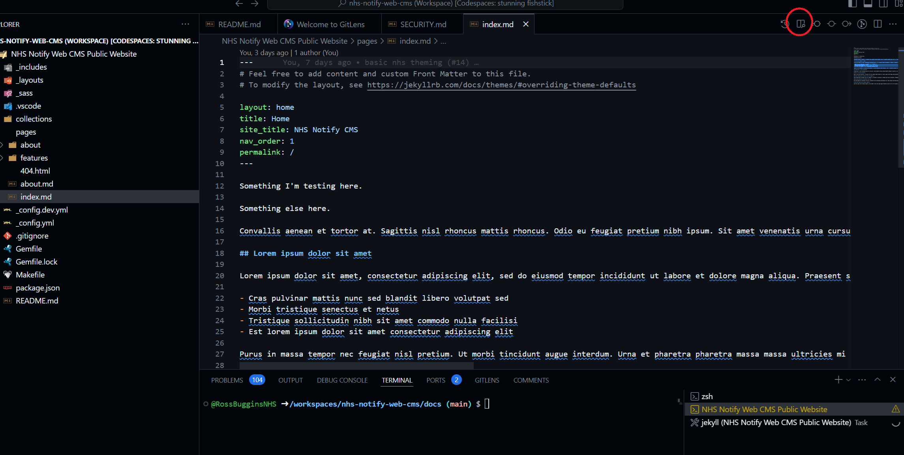

- this will open a preview to the right

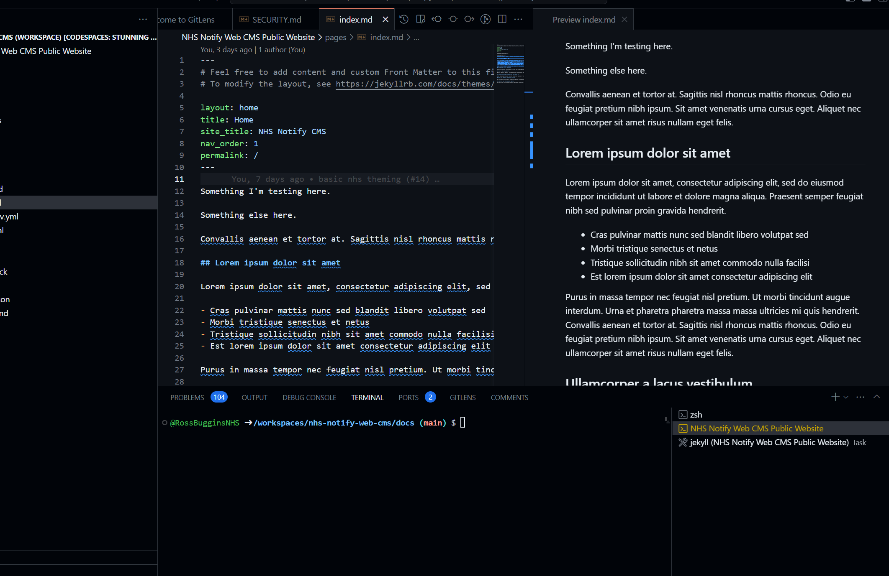

- If you now edit some text in the left, it will update in the basic preview on the right in real time. If you click `File` - `Save` (or `Ctrl-S`) this will save the file.

- Saving the file will update the Full preview site in the other browser tab.

- Open the other tab, and Press `F5` to refresh the page.

### 7. Making a change permanent and live

You must:

- create a new branch in your workspace
- commit the changes to your new branch
- push (publish) the new branch to your remote
- create a Pull Request for requesting that your remote branch is merged into main
- await approval
