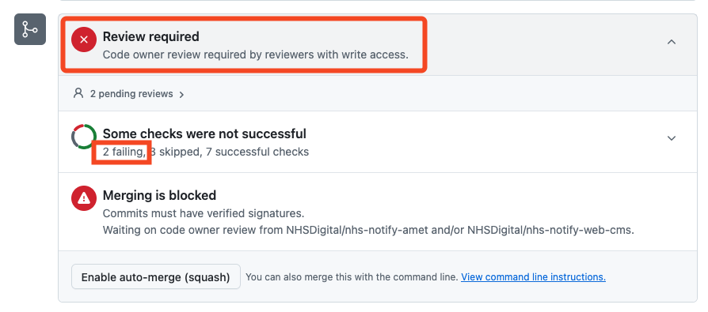

# NHS Notify Web CMS Repository

## About this project

- This site includes the content for the public [N]HS Notify web site](https://notify.nhs.uk/)
- It uses Jekyll to generate static web HTML files from markdown content
- The source code for the web site is in `/docs` directory
- Page content is inside the `/docs/pages` directory
- Page CSS is inside `/docs/_sass` directory
- The webpage is published to GitHub Pages using [this GitHub Actions workflow](.github/workflows/jekyll-gh-pages.yml)

### Pre-requisites

- A GitHub account
- For submitting changes; [**code must be signed** with a GPG key](setup/gpg.md) linked to your GitHub account.

#### Setup guides

- [GPG setup for Codespaces](setup/gpg.md)
- [First-time Codespaces setup](setup/codespaces.md)
- [GitHub Copilot quick start](setup/copilot.md)
- [FAQ](setup/faq.md)

### Making a changes checklist

- Create a new branch in your workspace
- Commit the changes to your new branch
- Push (publish) the new branch to your remote
- Create a Pull Request for requesting that your remote branch is merged into main
- Seek and await approvals
- Do not merge changes if all checks or are not passing.
  

### Open existing Codespaces

- You can reuse existing Codespaces that have been setup.
- Visit [https://github.com/codespaces](https://github.com/codespaces) to see a list of Codespaces
- Active Codespaces are charged. Everyone gets 150 hours free per month.
- Click on the `three dots` and then click `stop codespace` to change it to inactive
- A stopped code space does **not** loose data
- You can delete a Codespace, but this **will** loose any data that you have not pushed (published) to a remote git branch.
