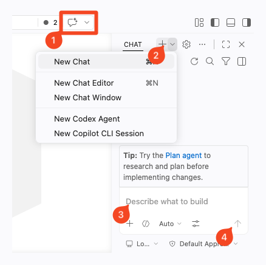

# GitHub Copilot Quick Start

GitHub Copilot is available inside your Codespace and can help you draft, edit, and improve content faster.

## Recommended guidance

For team guidance on safe and effective AI use, read:

- [NHS Engineering AI Coding Assistant User Guide](https://nhs.sharepoint.com/sites/X26_EngineeringCOE/SitePages/AI-Coding-Assistants---User-Guide.aspx?web=1&isSPOFile=1&ovuser=37c354b2-85b0-47f5-b222-07b48d774ee3%2Caiden.vaines2%40nhs.net&OR=Teams-HL&CT=1777458253077&clickparams=eyJBcHBOYW1lIjoiVGVhbXMtRGVza3RvcCIsIkFwcFZlcnNpb24iOiI1MC8yNjA0MDQwMTcxOCIsIkhhc0ZlZGVyYXRlZFVzZXIiOmZhbHNlfQ%3D%3D&linkOpenTime=1777458253084)
- [Making the best use of AI](https://nhsd-confluence.digital.nhs.uk/spaces/RIS/pages/1336633374/Team+SKYNET+Making+the+best+use+of+AI)
