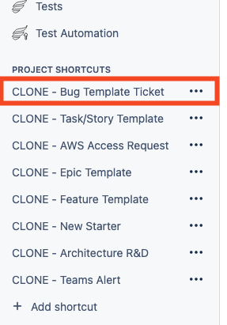
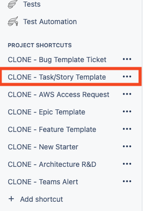

# FAQ

## I've not used git or VSCode (Codespaces) before

- You could start at https://www.youtube.com/watch?v=e9lnsKot_SQ for a brief 4 minute crashcourse in Git.
- There is a great overview of what Codespaces is here https://www.youtube.com/watch?v=sYJ3CHtT6WM.
- Fireship has a 100 seconds of VSCode https://www.youtube.com/watch?v=KMxo3T_MTvY video which shows the key features.

## Something is not working. What should I try first?

Turn it off and on again - restart your Codespace first. This fixes most issues, including GPG signing, stale environment variables, and preview problems.

1. Visit [https://github.com/codespaces](https://github.com/codespaces)
2. Find your Codespace in the list
3. Click the three dots menu on the right
4. Select **Stop Codespace**
5. Reopen the Codespace

## How do I check whether GPG commit signing is working?

Run these two commands in the Codespace terminal:

```bash
git config --list --show-origin | grep -E 'commit.gpgsign|gpg.program|user.signingkey|user.name|user.email|credential.helper'

git config --show-origin --get commit.gpgsign
```

The second command should return `file:.git/config        true`.

If it returns `false` or nothing:

- Complete all steps in [GPG setup](gpg.md)
- Confirm GitHub **Settings > Codespaces > GPG verification** is set to **All repositories**
- Restart your Codespace and re-check

## My commit is being rejected because it is not signed

This usually means GPG verification was not active when the Codespace started. Restart the Codespace and try committing again.

If you've already pushed the commit to remote, you'll need to re-sign that commit. Use this flow in your Codespace terminal:

```bash
git rebase -i HEAD~<number-of-commits>
```

Replace `<number-of-commits>` with how many commits back you need to go (for example, use `1` to re-sign the last commit).

In the editor that opens:

1. Change `pick` to `reword` for the commit(s) you need to re-sign
2. Save and close the editor
3. Edit the commit message (or just save if you don't need to change it)
4. When rebasing is complete, force push your changes:

```bash
git push --force-with-lease
```

This re-signs the commit and updates the remote branch. The `--force-with-lease` flag is safer than `--force` as it prevents overwriting others' work.

## Where can I get help with using AI or GitHub Copilot?

See [Copilot quick start](copilot.md) and the linked Team AI guidance.

## How do I bring my branch up to date with work already merged into main?

Use this flow in your Codespace terminal:

```bash
git checkout main
git pull
git checkout your-branch-name
git merge main
```

If there are no conflicts, complete the merge commit and continue your work.

If there are conflicts, resolve them in VS Code:

1. Open Source Control (left sidebar)
2. Open each conflicted file listed under merge changes
3. Use the buttons in the editor such as **Accept Current**, **Accept Incoming**, or **Accept Both**
4. Review the file and make any final manual edits
5. Save the file
6. Stage the resolved files

Then commit your resolution:

```bash
git commit
```

If you are stuck at any point, ask the team for help rather than guessing a conflict resolution.

## Where should I ask for ad-hoc guidance, support, or direction?

Use this Teams chat for ad-hoc guidance, support, and direction:

- [Team support chat](https://teams.microsoft.com/l/chat/19:b837810869a04ba195f98024229f874f@thread.v2/conversations?context=%7B%22contextType%22%3A%22chat%22%7D)

## How do I create a Jira bug ticket for issues I need support on?

Use the Jira project shortcut and include enough detail so someone else can reproduce and fix the issue.



Please include the following:

1. What is not working
2. What it should be doing instead
3. Exact steps to reproduce the problem - clear reproduction steps and branch details make triage much faster.
4. What you expected to happen
5. What actually happened
6. Your working branch name

## How do I create a Jira ticket for features, changes, or new functionality?

For any new features, changes, or functionality you're developing, raise a Jira task for prioritisation in a development cell.


